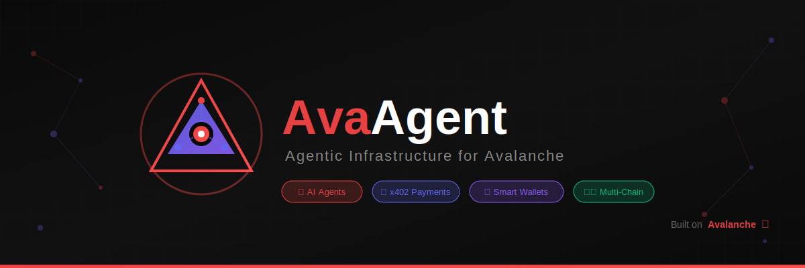

<div align="center">
  
  
  # AvaAgent 🔺
  
  **Your AI Assistants That Can Handle Money — Powered by Avalanche**
  
  
  
  [](https://www.avax.network/)
  [](https://nextjs.org/)
  [](https://fastapi.tiangolo.com/)
  [](https://soliditylang.org/)
  
  [Demo](https://avaagent.xyz) · [Documentation](./docs) · [API Reference](./docs/api.md)

</div>

---

## 🤔 What is AvaAgent?

**AvaAgent** is a platform where you can create **AI assistants that can actually spend money on your behalf** — safely and transparently on the blockchain.

Think of it like this: You have a smart assistant (like ChatGPT) that can not only *talk* to you, but also *do things* with your crypto — like trading tokens, buying products, or paying for services — all while following rules YOU set.

### The Simple Explanation

```
Traditional AI Chatbot          vs          AvaAgent
─────────────────────                       ─────────
Can answer questions                        Can answer questions
Can write content                           Can write content  
Can analyze data                            Can analyze data
❌ Can't spend money                        ✅ CAN spend money safely
❌ No real-world actions                    ✅ Executes real transactions
❌ Just gives advice                        ✅ Takes action for you
```

---

## 💡 Why Does This Matter?

### The Problem We Solve

Today, AI assistants can tell you *what* to do, but they can't *do it* for you. 

- ChatGPT can suggest "you should swap ETH for USDC" — but you still have to do it manually
- AI can analyze the best deals — but you still have to click "buy" yourself
- Bots can monitor prices 24/7 — but they can't act when you're asleep

**AvaAgent bridges this gap.** Your AI agent gets its own wallet, follows your rules, and takes action autonomously.

### Real-World Examples

| Scenario | Without AvaAgent | With AvaAgent |
|----------|------------------|---------------|
| **Trading** | You wake up at 3 AM to catch a price dip | Your agent buys automatically when price hits your target |
| **Payments** | Manually pay for each API call you use | Agent pays per request, only for what it uses |
| **Shopping** | Browse, compare, checkout manually | Agent finds deals and purchases within your budget |
| **DeFi** | Monitor yields, manually move funds | Agent auto-rebalances to maximize returns |

---

## 🎯 How It Works (Simple Version)

```
┌─────────────────────────────────────────────────────────────┐
│                    YOU (The Human)                          │
│                                                             │
│   1. Create an AI Agent                                     │
│   2. Give it a wallet with some crypto                      │
│   3. Set rules (e.g., "max $50/day", "only buy AVAX")      │
│   4. Tell it what to do in plain English                    │
└─────────────────────────────────────────────────────────────┘
                              │
                              ▼
┌─────────────────────────────────────────────────────────────┐
│                    YOUR AI AGENT                            │
│                                                             │
│   🧠 Understands your request (powered by Google Gemini)   │
│   💰 Has its own wallet with YOUR rules enforced           │
│   ⚡ Executes transactions on Avalanche blockchain         │
│   📊 Reports back what it did and why                       │
└─────────────────────────────────────────────────────────────┘
                              │
                              ▼
┌─────────────────────────────────────────────────────────────┐
│                    BLOCKCHAIN                               │
│                                                             │
│   ✅ All transactions are transparent & verifiable         │
│   🔒 Smart contracts enforce your spending limits          │
│   📝 Every action is recorded permanently                   │
└─────────────────────────────────────────────────────────────┘
```

---

## ✨ Key Features (Plain English)

### 🤖 Smart AI Agents
Create AI assistants that understand natural language. Just tell them what you want:
- *"Buy $20 of AVAX if the price drops below $35"*
- *"Monitor my portfolio and alert me if any token drops 10%"*
- *"Find the cheapest flight to NYC and book it"*

### 💼 Safe Wallets with Rules
Every agent gets a special wallet that follows YOUR rules:
- **Spending Limits**: "Max $100 per day"
- **Token Restrictions**: "Only trade AVAX and USDC"
- **Time Controls**: "Only active during market hours"
- **Approval Thresholds**: "Ask me before spending over $500"

### 💬 Chat Interface
Talk to your agents like you'd talk to a friend:
- Natural conversation (no coding required)
- See what the agent is "thinking" before it acts
- Real-time updates on transactions
- Full history of everything it's done

### 🔗 Multiple Blockchains
Works across different networks:
- **Avalanche** — Fast, cheap transactions
- **Kite Network** — AI-optimized blockchain
- More chains coming soon!

### 💰 Pay-Per-Use (x402)
Agents only pay for what they use:
- Data feeds? Pay per query
- AI processing? Pay per request
- No monthly subscriptions — just pay for actual usage

---

## 🏗️ Architecture (How It's Built)

AvaAgent has three main parts that work together:

```
┌─────────────────────────────────────────────────────────────────┐
│                     🖥️ FRONTEND (What You See)                  │
│                        Next.js Website                           │
│                                                                  │
│   Dashboard → Manage your agents and wallets                     │
│   Chat → Talk to your agents                                     │
│   Analytics → See what your agents are doing                     │
└──────────────────────────────┬───────────────────────────────────┘
                               │
                               ▼
┌─────────────────────────────────────────────────────────────────┐
│                     ⚙️ BACKEND (The Brain)                       │
│                        FastAPI Server                            │
│                                                                  │
│   AI Service → Google Gemini for smart decisions                 │
│   Wallet Service → Manages agent wallets safely                  │
│   Payment Service → Handles x402 micropayments                   │
│   Blockchain Service → Talks to Avalanche & Kite                 │
└──────────────────────────────┬───────────────────────────────────┘
                               │
                               ▼
┌─────────────────────────────────────────────────────────────────┐
│                  ⛓️ SMART CONTRACTS (The Rules)                  │
│                    On Avalanche Blockchain                       │
│                                                                  │
│   AgentRegistry → Keeps track of all agents                      │
│   WalletFactory → Creates secure wallets                         │
│   PaymentFacilitator → Processes payments                        │
│   IntentProcessor → Executes agent actions                       │
└─────────────────────────────────────────────────────────────────┘
```

## 📦 Project Structure (For Developers)

```
AvaAgent/
├── frontend/          # 🖥️ The website you interact with
│   └── src/
│       ├── app/       # Pages (dashboard, chat, wallets)
│       ├── components/# UI building blocks
│       └── lib/       # Helper functions
│
├── backend/           # ⚙️ The server that does the work
│   └── app/
│       ├── api/       # REST endpoints
│       ├── services/  # Business logic (AI, blockchain, payments)
│       └── models/    # Database models
│
├── contracts/         # ⛓️ Smart contracts on blockchain
│   └── src/
│       ├── wallet/    # Agent wallet contracts
│       ├── registry/  # Agent registration
│       └── payments/  # Payment processing
│
└── docker-compose.yml # 🐳 Run everything with one command
```

## 🛠️ Tech Stack (What We Used)

| Layer | Technology | Why? |
|-------|------------|------|
| **Website** | Next.js 14, TypeScript, Tailwind CSS | Fast, modern, beautiful UI |
| **Server** | FastAPI (Python) | Quick to build, great for AI |
| **Database** | Neon PostgreSQL | Serverless, scales automatically |
| **AI Brain** | Google Gemini | Best reasoning for agent decisions |
| **Blockchain** | Avalanche, Solidity, Foundry | Fast transactions, low fees |
| **Auth** | Clerk | Secure login without the hassle |

## 🚀 Quick Start (Get It Running)

### What You Need
- Node.js 20+ (for the website)
- Python 3.11+ (for the server)
- Docker (optional, makes things easier)

### Option 1: One Command (Recommended)
```bash
# Clone the project
git clone https://github.com/yourusername/avaagent.git
cd avaagent

# Copy environment file and add your API keys
cp .env.example .env

# Run everything with Docker
docker-compose up -d

# Open http://localhost:3000 in your browser 🎉
```

### Option 2: Run Manually

**Start the Backend (API Server):**
```bash
cd backend
uv venv && source .venv/bin/activate  # Windows: .venv\Scripts\activate
uv pip install -e .
uv run uvicorn app.main:app --reload
# Server runs at http://localhost:8000
```

**Start the Frontend (Website):**
```bash
cd frontend
npm install
npm run dev
# Website runs at http://localhost:3000
```

## 📝 API Overview (For Developers)

### Manage Agents
```
POST   /api/v1/agents         → Create a new agent
GET    /api/v1/agents         → List your agents
GET    /api/v1/agents/{id}    → Get agent details
DELETE /api/v1/agents/{id}    → Delete an agent
```

### Manage Wallets
```
POST   /api/v1/wallets        → Create wallet for agent
GET    /api/v1/wallets/{id}   → Get wallet balance
```

### Chat with AI
```
POST   /api/v1/ai/chat        → Send message, get response
POST   /api/v1/ai/chat/stream → Stream response in real-time
```

### Payments (x402)
```
POST   /api/v1/payments       → Create payment
GET    /api/v1/payments/{id}  → Check payment status
```

> 📖 Full API docs at http://localhost:8000/docs when running locally

## 🔐 Security (How We Keep Your Money Safe)

| Protection | What It Does |
|------------|--------------|
| **Clerk Auth** | Secure login with 2FA support |
| **JWT Tokens** | Every API call is verified |
| **Smart Contract Rules** | Spending limits enforced by code, not trust |
| **Rate Limiting** | Prevents abuse and spam |
| **Token Whitelisting** | Agents can only use tokens you approve |

## 🌐 Deployed Smart Contracts

Our contracts are live and verified on both testnets:

### Avalanche Fuji Testnet (Chain ID: 43113)
| Contract | Address | What It Does |
|----------|---------|--------------|
| WalletFactory | [`0x849Ca...833a8`](https://testnet.snowtrace.io/address/0x849Ca487D5DeD85c93fc3600338a419B100833a8) | Creates new agent wallets |
| AgentRegistry | [`0xD26ae...af28`](https://testnet.snowtrace.io/address/0xD26ae761DEBE79Ca423A370C0085D75b26Ecaf28) | Tracks all registered agents |
| PaymentFacilitator | [`0xD5932...6ADF`](https://testnet.snowtrace.io/address/0xD5932aF5c315C0A1fD9D486E0f58b7C210866ADF) | Handles x402 payments |
| IntentProcessor | [`0x4B617...5BC4`](https://testnet.snowtrace.io/address/0x4B6171fA771fdA1F86445a5C06b0d5dA11875BC4) | Executes agent actions |

### Kite AI Testnet (Chain ID: 2368)
| Contract | Address | What It Does |
|----------|---------|--------------|
| WalletFactory | [`0x849Ca...833a8`](https://testnet.kitescan.ai/address/0x849Ca487D5DeD85c93fc3600338a419B100833a8) | Creates new agent wallets |
| AgentRegistry | [`0xD26ae...af28`](https://testnet.kitescan.ai/address/0xD26ae761DEBE79Ca423A370C0085D75b26Ecaf28) | Tracks all registered agents |
| PaymentFacilitator | [`0xD5932...6ADF`](https://testnet.kitescan.ai/address/0xD5932aF5c315C0A1fD9D486E0f58b7C210866ADF) | Handles x402 payments |
| IntentProcessor | [`0x4B617...5BC4`](https://testnet.kitescan.ai/address/0x4B6171fA771fdA1F86445a5C06b0d5dA11875BC4) | Executes agent actions |

> 💡 **Deploy to Kite AI Testnet**: Get KITE tokens from the [faucet](https://faucet.gokite.ai) and run:
> ```bash
> cd contracts
> forge script script/Deploy.s.sol:DeployAvaAgent --rpc-url https://rpc-testnet.gokite.ai --broadcast --private-key $PRIVATE_KEY
> ```

## 🔌 Integrations (Services We Connect To)

| Service | What It Does | Why It Matters |
|---------|--------------|----------------|
| **x402 Protocol** | Pay-per-request payments | Agents only pay for what they use |
| **Kite Network** | AI-optimized blockchain | Verifiable AI inference |
| **Turf Network** | Real-time data feeds | Agents get live market data |
| **Reap Protocol** | E-commerce bridge | Agents can buy real products |
| **Thirdweb** | Wallet infrastructure | Easy wallet creation & management |

## 📊 Performance

- ⚡ **API Response**: Under 100ms
- 🔗 **Transaction Speed**: 2-5 seconds on Avalanche
- 🤖 **AI Streaming**: Real-time responses
- 📈 **Scale**: Handles 10,000+ concurrent users

## 🗺️ What's Next (Roadmap)

- [x] ✅ Core agent infrastructure
- [x] ✅ Smart wallet deployment  
- [x] ✅ AI chat interface
- [x] ✅ x402 payment integration
- [ ] 🔄 Multi-agent collaboration (agents working together)
- [ ] 🔄 Custom Avalanche L1 deployment
- [ ] 📱 Mobile app
- [ ] 🏪 Agent marketplace (buy/sell agent templates)

---

## 🤝 Contributing

We welcome contributions! See [CONTRIBUTING.md](./CONTRIBUTING.md) for guidelines.

## 🧪 Testing

**Backend Tests:**
```bash
cd backend
uv run pytest -v --cov=app
```

**Frontend Tests:**
```bash
cd frontend
npm run test
```

**Smart Contract Tests:**
```bash
cd contracts
forge test -vvv
```

## ⚙️ Environment Variables

Create `.env` files from the examples provided:

```bash
# Root level
cp .env.example .env

# Backend
cp backend/.env.example backend/.env

# Frontend  
cp frontend/.env.example frontend/.env

# Contracts
cp contracts/.env.example contracts/.env
```

**Required API Keys:**
| Service | Get Key From | Used For |
|---------|--------------|----------|
| Clerk | [clerk.com](https://clerk.com) | User authentication |
| Google Gemini | [ai.google.dev](https://ai.google.dev) | AI agent intelligence |
| Thirdweb | [thirdweb.com](https://thirdweb.com) | Wallet infrastructure |
| Neon | [neon.tech](https://neon.tech) | PostgreSQL database |

## 🐳 Docker Deployment

**Development:**
```bash
docker-compose -f docker-compose.yml -f docker-compose.dev.yml up
```

**Production:**
```bash
# Copy production environment files
cp backend/.env.production backend/.env
cp frontend/.env.production frontend/.env

# Edit with your production values
nano backend/.env
nano frontend/.env

# Deploy
./scripts/deploy-production.sh --build --migrate

# Or manually:
docker-compose -f docker-compose.production.yml up -d --build
```

> 📖 See [DEPLOYMENT.md](./docs/DEPLOYMENT.md) for full production deployment guide including SSL, CI/CD, and cloud platform options.

### Production Checklist
- [ ] `DEMO_MODE=false` in backend `.env`
- [ ] Production Clerk keys configured
- [ ] SSL certificates installed
- [ ] Database migrated (`alembic upgrade head`)
- [ ] Health checks passing

## 📚 Documentation

- [Architecture Guide](./docs/ARCHITECTURE.md) — System design & data flow
- [API Reference](./docs/api.md) — Full endpoint documentation  
- [SDK Guide](./docs/SDK_GUIDE.md) — Integration guide for developers
- [Threat Model](./docs/THREAT_MODEL.md) — Security considerations
- [Contract Deployment](./contracts/DEPLOYMENT.md) — Smart contract deployment guide

## 🐛 Troubleshooting

| Issue | Solution |
|-------|----------|
| Database connection failed | Check `DATABASE_URL` in `.env` |
| Clerk auth not working | Verify `CLERK_SECRET_KEY` and `CLERK_PUBLISHABLE_KEY` |
| AI responses empty | Check `GOOGLE_API_KEY` is valid |
| Contract deployment fails | Ensure wallet has testnet tokens |
| Frontend 500 errors | Check backend is running on port 8000 |

## 👥 Team

Built with ❤️ for the **Avalanche Hack2Build Hackathon 2025**

## 📄 License

MIT License - see [LICENSE](./LICENSE) for details

## ⭐ Star History

If you find AvaAgent useful, please consider giving it a star! It helps others discover the project.

---

<div align="center">
  <strong>Built on Avalanche 🔺</strong>
  <br />
  <sub>The fastest, most reliable smart contracts platform</sub>
  <br /><br />
  <a href="https://github.com/yourusername/avaagent/issues">Report Bug</a>
  ·
  <a href="https://github.com/yourusername/avaagent/issues">Request Feature</a>
  ·
  <a href="https://discord.gg/avaagent">Join Discord</a>
</div>
